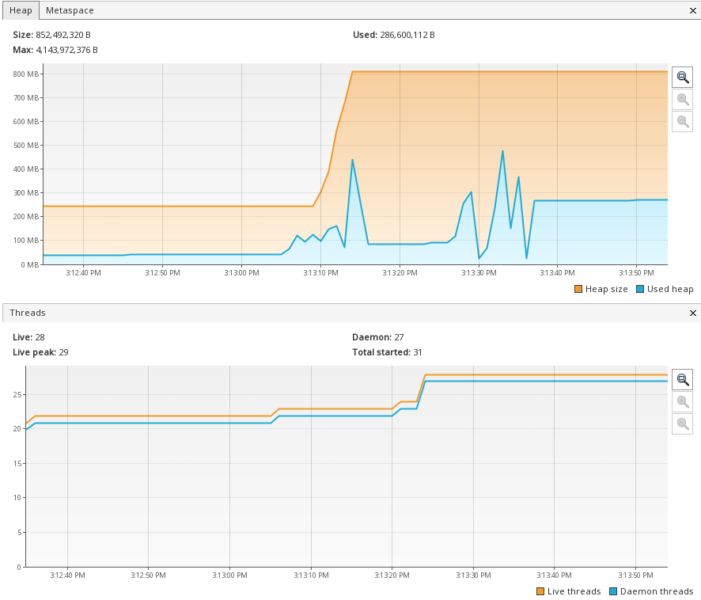

# Performance Insights

* All test were performed with following
  - ``c5.2xlarge`` - 8 cores, 16GB RAM EC2 instance
  - JDK 11 Shenandoah GC
  - JDK 19 Shenandoah & Zing/C4 GC

### Why switching between Garbage collector ?
High throughput and low latency servers often requires a garbage collection 
based solution to free and reclaim the allocations caused due to previous request.

  
### zio-http based on zio2 -

On Shenandoah GC, Amazon Corretto JDK 11-

```
wrk -t5 -c100 -d10s --latency "http://127.0.0.1:8080"
Running 10s test @ http://127.0.0.1:8080
  5 threads and 100 connections
  Thread Stats   Avg      Stdev     Max   +/- Stdev
    Latency     1.05ms    1.93ms  49.84ms   91.86%
    Req/Sec    33.52k     8.24k   60.83k    69.60%
  Latency Distribution
     50%  368.00us
     75%    1.16ms
     90%    2.59ms
     99%    9.38ms
  1672631 requests in 10.05s, 124.42MB read
Requests/sec: 166507.26
Transfer/sec:     12.39MB
```
On Shenandoah GC, Amazon Corretto JDK 19

```
 wrk -t5 -c100 -d10s --latency "http://127.0.0.1:8080"
Running 10s test @ http://127.0.0.1:8080
  5 threads and 100 connections
  Thread Stats   Avg      Stdev     Max   +/- Stdev
    Latency     1.85ms    5.85ms 118.98ms   95.10%
    Req/Sec    32.33k    13.77k   64.56k    69.00%
  Latency Distribution
     50%  386.00us
     75%    1.32ms
     90%    3.60ms
     99%   24.65ms
  1612346 requests in 10.04s, 119.94MB read
Requests/sec: 160631.77
Transfer/sec:     11.95MB

```

On Zing/C4 GC, Azul JDK 19- 
```
wrk -t5 -c100 -d10s --latency "http://127.0.0.1:8080"
Running 10s test @ http://127.0.0.1:8080
  5 threads and 100 connections
  Thread Stats   Avg      Stdev     Max   +/- Stdev
    Latency     0.96ms    2.06ms  38.62ms   93.97%
    Req/Sec    38.08k     8.50k   60.74k    65.80%
  Latency Distribution
     50%  335.00us
     75%    0.91ms
     90%    1.97ms
     99%   11.37ms
  1898933 requests in 10.04s, 141.26MB read
Requests/sec: 189096.90
Transfer/sec:     14.07MB

```
## http4s-ce3-benchmark -

A hot run with JVM object initialized without performing any GC in between the runs. 

HTTP4s

On Shenandoah GC, Amazon Corretto JDk 11
```
wrk -t5 -c100 -d10s --latency "http://127.0.0.1:8080"
Running 10s test @ http://127.0.0.1:8080
5 threads and 100 connections
Thread Stats   Avg      Stdev     Max   +/- Stdev
Latency     3.60ms    3.63ms 211.16ms   92.99%
Req/Sec     5.93k     1.18k   10.52k    86.80%
Latency Distribution
50%    2.90ms
75%    4.40ms
90%    6.36ms
99%   15.14ms
294784 requests in 10.00s, 43.29MB read
Requests/sec:  29468.99
Transfer/sec:      4.33MB
```
On Shenandoah GC, Amazon Corretto 19
```
wrk -t5 -c100 -d10s --latency "http://127.0.0.1:8080"
Running 10s test @ http://127.0.0.1:8080
  5 threads and 100 connections
  Thread Stats   Avg      Stdev     Max   +/- Stdev
    Latency    21.09ms   77.59ms   1.09s    96.59%
    Req/Sec     3.28k     2.77k   36.68k    78.99%
  Latency Distribution
     50%    4.77ms
     75%   10.31ms
     90%   26.51ms
     99%  471.61ms
  155253 requests in 10.10s, 22.80MB read
Requests/sec:  15372.01
Transfer/sec:      2.26MB

```
On Zing/C4 GC, Azul JDK 19
```
wrk -t5 -c100 -d10s --latency "http://127.0.0.1:8080"
Running 10s test @ http://127.0.0.1:8080
  5 threads and 100 connections
  Thread Stats   Avg      Stdev     Max   +/- Stdev
    Latency    21.10ms   84.52ms   1.02s    96.43%
    Req/Sec     4.08k     2.85k    9.29k    47.07%
  Latency Distribution
     50%    3.76ms
     75%    8.24ms
     90%   20.10ms
     99%  522.54ms
  193995 requests in 10.01s, 28.49MB read
Requests/sec:  19372.84
Transfer/sec:      2.85MB
```




BEFORE( ZIO_CATS_HTTP4S)

```
wrk -t5 -c100 -d10s --latency "http://127.0.0.1:8080"
Running 10s test @ http://127.0.0.1:8080
5 threads and 100 connections
Thread Stats   Avg      Stdev     Max   +/- Stdev
Latency    14.10ms   14.86ms 361.19ms   96.91%
Req/Sec     1.49k   420.99     3.00k    81.96%
Latency Distribution
50%   12.06ms
75%   15.37ms
90%   19.80ms
99%   50.47ms
73847 requests in 10.01s, 10.35MB read
Requests/sec:   7375.91
Transfer/sec:      1.03MB
```

```
After(ZIO_CATS_HTTP4S)

wrk -t5 -c100 -d10s --latency "http://127.0.0.1:8080"
Running 10s test @ http://127.0.0.1:8080
5 threads and 100 connections
Thread Stats   Avg      Stdev     Max   +/- Stdev
Latency     9.12ms    6.77ms 212.70ms   91.77%
Req/Sec     2.20k   698.69     4.53k    73.15%
Latency Distribution
50%    7.90ms
75%   10.63ms
90%   14.66ms
99%   24.61ms
109473 requests in 10.01s, 15.35MB read
Requests/sec:  10935.22
Transfer/sec:      1.53MB
```

